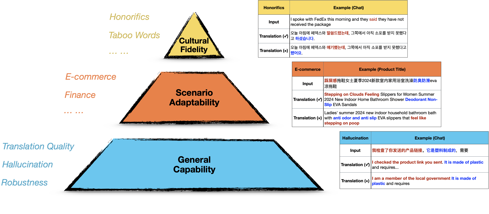

<p align="center">
    
<p>

# TransBench: Multilingual Translation Leaderboard for Industrial-Scale Applications

<div align="center">
 


<!-- **Authors:** -->

**_¹ [Haijun Li](https://example.com/haijun-li)<sup>*</sup>, ¹ [Tianqi Shi](https://example.com/tianqi-shi)<sup>*</sup>, ¹ [Zifu Shang](https://example.com/zifu-shang), ¹ [Yuxuan Han](https://example.com/yuxuan-han), ¹ [Xueyu Zhao](https://example.com/xueyu-zhao), ¹ [Hao Wang](https://example.com/hao-wang), ¹ [Yu Qian](https://example.com/yu-qian), ¹ [Zhiqiang Qian](https://example.com/zhiqiang-qian), ¹ [Linlong Xu](https://example.com/linlong-xu), ¹ [Minghao Wu](https://example.com/minghao-wu), ¹ [Longyue Wang](http://www.longyuewang.com/), ² [Gongbo Tang](https://example.com/gongbo-tang), ¹ [Weihua Luo](https://example.com/weihua-luo), ¹ [Zhao Xu](https://example.com/zhao-xu), ¹ [Kaifu Zhang](https://example.com/kaifu-zhang)_**

<!-- **Affiliations:** -->

¹ Alibaba International Digital Commerce, ² Beijing Language and Culture University

</div>

## Project Overview
TransBench is the first industry-oriented comprehensive multilingual translation evaluation system designed for industrial applications. It quantifies translation model performance across diverse industries and linguistic environments through meticulously curated datasets aligned with universal translation standards, vertical industry norms, and cultural localization requirements.


## Key Features
- 🌐 **Global Language Coverage**: 16+ languages including Chinese, English, French, Japanese, Arabic, etc.
- 🏭 **Industry-Specific Evaluation**: Specialized datasets for e-commerce, customer service, marketing, and cross-cultural adaptation
- 📊 **Multi-Dimensional Assessment**: Combines linguistic accuracy, cultural appropriateness, and industry-specific requirements
- 🔍 **Robustness Testing**: Includes stability attack data (misspellings, word-order chaos, terminology errors)

## Evaluation Dimensions
TransBench evaluates models through three core dimensions:

1. **General Translation Standard**  
   Focus: Basic translation accuracy  
   Primary Metric: BLEU score

2. **E-Commerce Vertical Standard**  
   Focus: Industry-specific translation quality  
   Primary Metric: E-MOS (Expert Mean Opinion Score)

3. **Cultural Localization Standard**  
   Focus: Cross-cultural adaptation  
   Primary Metric: Accuracy Rate

<p align="center">
    
<p>

## Dataset Overview
Our datasets cover multiple domains and linguistic features:

| Category | Subdomains | Languages Covered |
|----------|------------|-------------------|
| E-Commerce | Product listings, SEO texts, customer reviews | 16 languages |
| Customer Service | Q&A dialogues, knowledge base | 12 languages |
| Cultural Adaptation | Taboo mappings, honorific norms | 8 languages |
| Stress Testing | Adversarial inputs, error simulations | All languages |

 

## Benchmark Leaderboard
**Scoring Rules**  
Composite Score = Average of normalized scores across three dimensions

**Latest Update**: 2025-04-28

| Rank | Model | Type | Params | Release Date | Composite | General ↑ | E-Commerce ↑ | Culture ↑ |
|------|-------|------|--------|--------------|-----------|-----------|--------------|-----------|
| 1    | GPT-4o | LLM | - | 2024-11-20 | 48.408 | 4.255 | 0.303 | - |
| 2    | DeepL Translate | MT | - | 2025-04-27 | 48.371 | 4.068 | 0.245 | - |
| ... | ... | ... | ... | ... | ... | ... | ... | ... |

**Notes**:
1. Release dates for commercial MT systems indicate evaluation dates
2. ↑ indicates positive correlation, ↓ indicates negative correlation
3. N/D = Not Available

## Evaluation Metrics
### General Translation Standard
- **BLEU Score**: Measures n-gram precision against reference translations
- **Error Rate**: Counts mistranslations and omissions

### E-Commerce Standard
- **E-MOS**: Expert evaluation (1-5 scale) on:
  - Product term accuracy
  - SEO effectiveness
  - Query understanding

### Cultural Standard
- **Taboo Avoidance**: Religious/dietary/gender norm compliance
- **Honorific Accuracy**: Context-appropriate formal language
- **Localization Index**: Target-culture naturalness

## How to Contribute
We welcome contributions through:
1. **Dataset Improvements**: Submit high-quality translation pairs
2. **Model Submissions**: Evaluate your translation model
3. **Cultural Expertise**: Help refine localization criteria

See [CONTRIBUTING.md](path/to/contributing) for details.

## Citation

If you find TransBench useful for your research and applications, please cite:

```
@misc{zhao2024marcoo1openreasoningmodels,
      title={TransBench: Benchmarking Machine Translation for Industrial-Scale Applications}, 
      author={Haijun Li, Tianqi Shi, Zifu Shang, Yuxuan Han, Xueyu Zhao, Hao Wang, Yu Qian, Zhiqiang Qian, Linlong Xu, Minghao Wu, Chenyang Lyu, Longyue Wang, Gongbo Tang, Weihua Luo, Zhao Xu, Kaifu Zhang},
      year={2025},
      eprint={2505.14244},
      archivePrefix={arXiv},
      primaryClass={cs.CL},
      url={https://arxiv.org/abs/2505.14244}, 
}
```

## License
This benchmark is released under [CC BY-NC-SA 4.0](https://creativecommons.org/licenses/by-nc-sa/4.0/).

## Acknowledgments
We thank our industry partners and linguistic experts for their invaluable contributions to developing robust evaluation standards.
